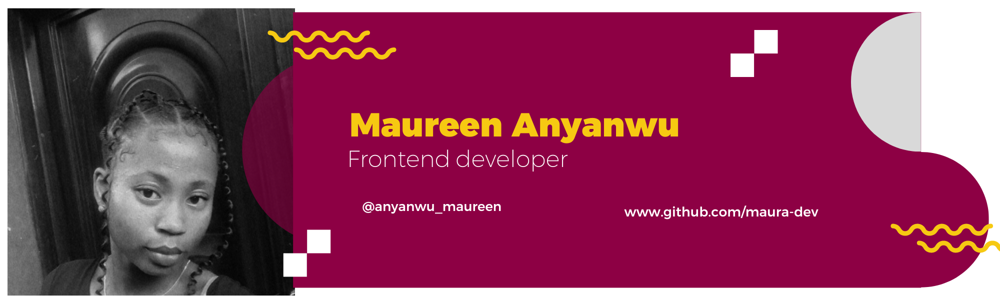

# Welcome to my space!

<h1 align="center">Hi there👋, I am Maureen Anyanwu</h1>
<h3 align="center">A passionate frontend developer 👩‍💻 from Nigeria 🇳🇬  and wannabe technical writer who is currently learning about Web3 </h3>

  

- 👨‍💻 All of my projects are available at [https://maura-dev.netlify.app](https://maura-dev.netlify.app)

- 📝 I regularly write articles on tech stuff via hashnode [here](https://maura-dev.hashnode.dev/)

- 📫 You can reach me via email: **maureenanyanwu519@gmail.com**

- ⚡ Fun fact **I love watching movies and traveling**

 <h3 align="left">Languages and Tools:</h3>

             

### Projects:
- 🌱 Contributed to i2talk chat app during TIIDELab fellowship. See demo [here](https://i2talk-chat-app.netlify.app/)
- 🌱 Contributed to ZC main and ZC company sales prospect during HNGi8. See demo [here](https://staging.zuri.chat/)
- 🌱 Resource edge task as a standardization test under Learnable '21. See demo [here](https://r-edge.netlify.app/)
- 🌱 Decipher app, a choice maker app. See demo [here](https://decipher-choice-maker.netlify.app/)
- 🌱 A simple portfolio site with HTML and CSS. See demo [here](https://maura-dev.github.io/learnable-portfolio-task/)
- 🌱 Bookmark landing page challenge from frontend mentor. See demo [here](https://maura-dev.github.io/sca-level-six-task/)
- 🌱 HackerNews website replica fetching news data from their API. See demo [here](https://hn-replica.netlify.app/)

 <h3 align="left">Connect with me:</h3>

 

 

<!--
**maura-dev/maura-dev** is a ✨ _special_ ✨ repository because its `README.md` (this file) appears on your GitHub profile.

Here are some ideas to get you started:

- 🔭 I’m currently working on ...
- 🌱 I’m currently learning ...
- 👯 I’m looking to collaborate on ...
- 🤔 I’m looking for help with ...
- 💬 Ask me about ...
- 📫 How to reach me: ...
- 😄 Pronouns: ...
- ⚡ Fun fact: ...
-->
